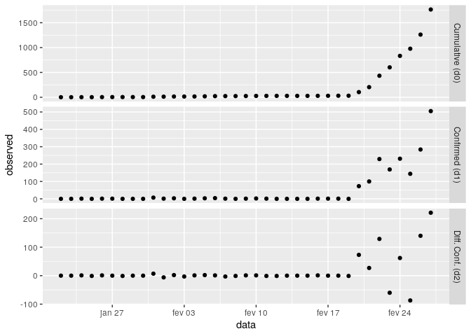
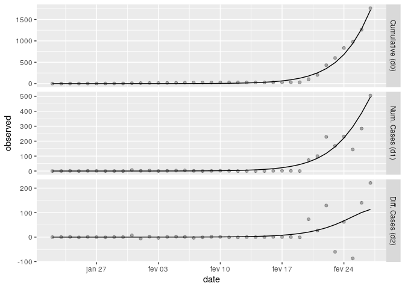
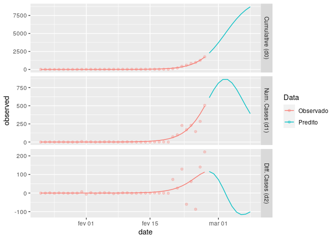

<!-- README.md is generated from README.Rmd. Please edit that file -->

# covid19peakfit package

<!-- badges: start -->

<!-- badges: end -->

The `covid19peakfit` package fits an experimental model to estimate the
peak of confirmed infected with COVID-19.

This package is part of [UNICAMP’s BCB
Lab](https://github.com/labbcb/covid19unicamp) task force against
COVID-19.

## Installation

Install from [GitHub](https://github.com/) with:

``` r
# install.packages("devtools")
devtools::install_github("gabrielfranco89/covid19peakfit")
```

## Example

To visualize data and have an idea for initial parameters:

``` r
library(covid19peakfit)
df <- subset(korea_covid19, subset = date <= "2020-02-27")

## Must prep data before graph
df_prep <- prep_data(df, cum_cases = "cum_cases", date_var = "date")
visu(df_prep)
```



To fit model:

``` r
fit <- covid19peakfit(data = df,
                      cum_cases = "cum_cases",
                      date_var = "date",
                      init_pars = c(10000, 40, 1),
                      lim_inf = c(max(df$cum_cases),
                                  40,
                                  0),
                      weights = c(.1,.1,3))

fit$plot
```



  - Estimated peak day: 2020-03-03
  - Real peak day: 2020-03-04

You can also check for future
days:

``` r
future(fit, n_fut=10)
```



# Links

  - BCB Lab: <https://github.com/labbcb/covid19unicamp>
  - `datacovidbr` package for COVID-19 data download for R:
    <https://github.com/Freguglia/datacovidbr>
  - Estimativa do pico de casos de COVID-19 em Campinas (in Portuguese):
    <http://bcblab.org/covid19unicamp/analise_curvas/campinas>
